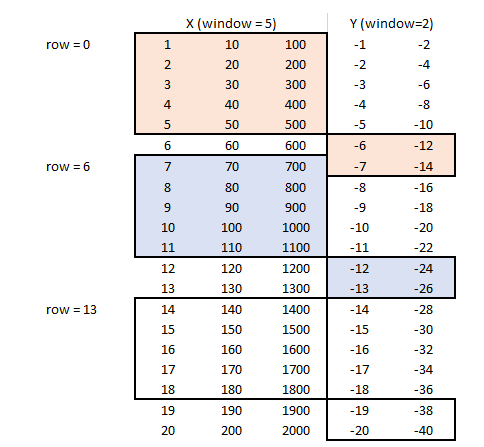
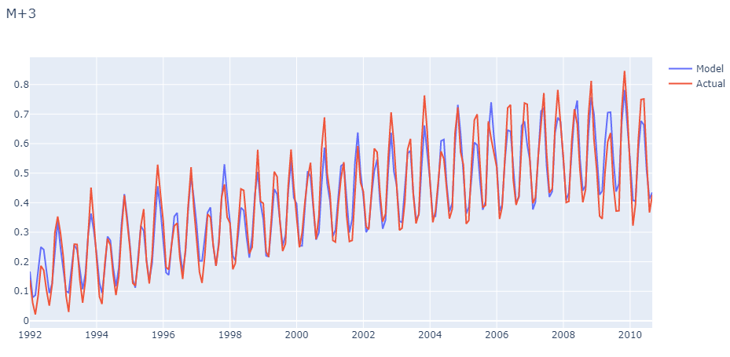
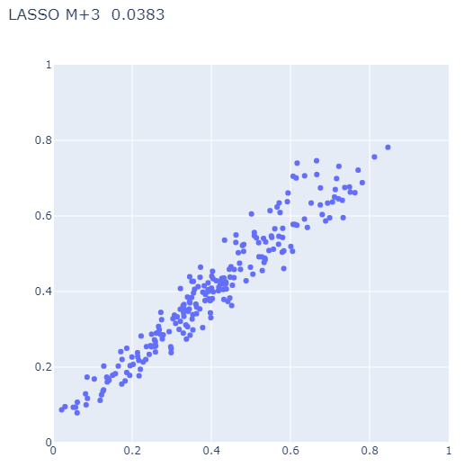
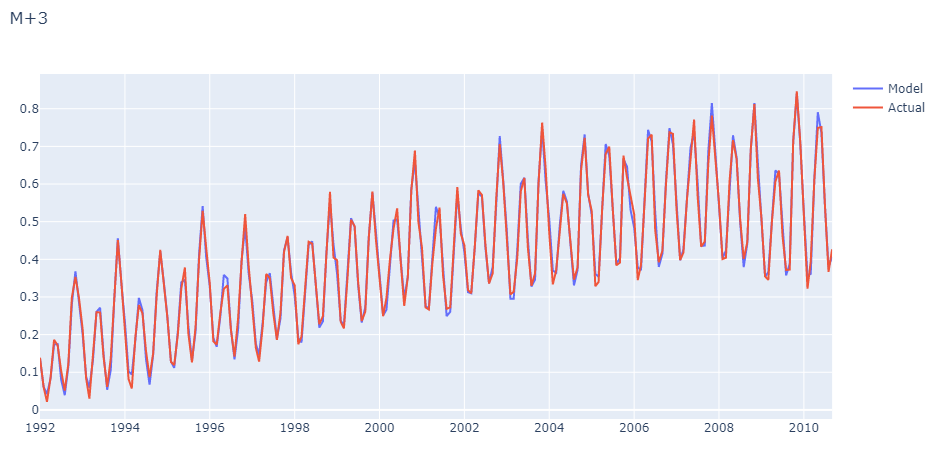
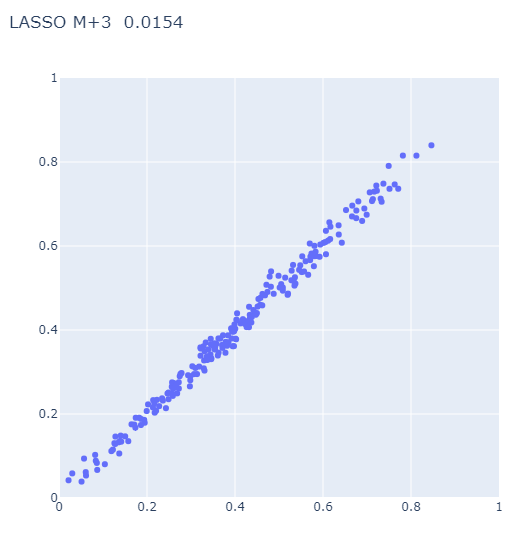

# Overview

This is demonstration uses LSTM networks to forecast samples time series data. The model includes four data sets from FRED, electricity and gas demand (our prediction objective), and the 1, 5, and 10 year US T-bills yields. The objective is to forecast electricity demand using electricity consumption in an autoregressive capacity, and using the T-bill yields as additional predictors. The rationale for including these variables is that the shape of the yield curve is thought to correlate with economic health, which in turn should correlate to electricity usage.

## Setup

Clone the repository and install the requirements (`requirements.txt`) into a virtual environment. Note that the `jupytext` plugin is used to convert the Jupyter notebooks to markdown which works much better with `diff`.

## Modeling

## Data Conditioning

The raw data from FRED is first cleaned and up-sampled to daily values using step interpolation (previous value) to fill in gaps. Data outside of the range of values in extrapolated using the last know good value at either endpoint. The data is then put in the range [0,1] using an extended version of the `MinMaxScaler` in `scikit-learn` , `lstmutil.Scaler`. This modified scaler adds support for serialization to and from JSON.

Note that we are not taking first differences or making any transformations (like `log y`), which would normally be done for time series data. The intent was to keep this demonstration as simple as possible. The first part of the Jupyter notebook `process_fred` performs this data normalization.

## Rolling Horizon

In order to prepare the data for linear and non-linear modeling, the concept of a rolling horizon is employed. Briefly, we define an input window and an output window, and the windows are "slid forward" in time. In the following table, rows denote time, the first three columns are the input variables, and the final 2 columns are the output values. Each shaded area represents a window. Three windows in total are shown, one at `t=0`, one at `t=6`, and one at `t=13`. The prediction window begins at the end of the feature window.

The data for each time step is unrolled (unraveled), along the feature axis first. The example above has a input window size of 5 with 3 features, and an output window size of 2, with two features. Row 6 input data above would be `[7, 70, 700, 8, 80, 800 ... 11, 110, 1100]` (`t = -2, -1, 0`) when unraveled and the output data would be [-12, -24, -13, -26] (`t = +1, +2`). The second half of the notebook `process_fred` completes this task using static methods from `lstmutil.TimeSeries` class.

## Validation/Parameter Search Strategy

Time series data in is general highly correlated in time (auto-correlation), so standard out of the box validation procedures like fully random K-fold validation will not work. For an overview of the challenges see:

- https://medium.com/@samuel.monnier/cross-validation-tools-for-time-series-ffa1a5a09bf9
- On the use of cross-validation for time series predictor evaluation. C Bergmeir, JM Benítez - Information Sciences, 2012 - Elsevier
- A note on the validity of cross-validation for evaluating autoregressive time series prediction. C Bergmeir, RJ Hyndman, B Koo - Computational Statistics & Data Analysis, 2018 - Elsevier

In this project we use a simple rolling horizon method, with a timestep of a single month. For example, at a single point in time, 24 different values of one of the predictors (the 1-year T-Bill) is used for modeling, which would be a vertical slice of the following chart (only 3 values are shown for clarity)

At any given time, we have 24 x 4 = 96 predictors available. We then trying to predict the next three months in time. We start the training as far back in history as our data allows, and slowly move forward in time. Therefore at no point do futures values get used or contaminate validation set prediction.

## Models

Two modeling approaches are tested, a linear model using the [LASSO](https://en.wikipedia.org/wiki/Lasso_(statistics)) and a neural network model based on the [LSTM framework](https://en.wikipedia.org/wiki/Long_short-term_memory). The notebook `modeling` walks the user through each approach.

The adjustable parameter in the LASSO algorithm is `alpha` and the optimal value is found through the validation procedure outlined above. The following is the `M+3` prediction (three months ahead) as a function of time, and a parity plot comparing actuals vs. predicted values:

A simple LSTM model is fit to the data, this time the number of units in the LSTM layer and the size of a dense hidden layer are used as the adjustable parameter. The following is the `M+3` prediction (three months ahead) as a function of time, and a parity plot comparing actuals vs. predicted values:

Comparing the two, a slight improvement is seen with the LSTM network relative to the linear model, albeit not worth the added complexity and computational cost in this case.

### Data sets used in this work

| *Filename*       | *Description*                                           |
| ---------------- | ------------------------------------------------------- |
| `DGS1.csv`       | FRED, 1-Year Treasury Constant Maturity Rate (DGS1) Percent, Not Seasonally Adjusted, Updated: Nov 10, 2020                   |
| `DGS5.csv`       | FRED, 5-Year Treasury Constant Maturity Rate (DGS5) Percent, Not Seasonally Adjusted, Updated: Nov 10, 2020                   |
| `DGS10.csv`      | FRED, 10-Year Treasury Constant Maturity Rate (DGS10) Percent, Not Seasonally Adjusted, Updated: Nov 10, 2020                 |
| `IPG2211A2N.csv` | FRED, Industrial Production: Electric and Gas (NAICS = 2211,2) Index 2012=100, Not Seasonally Adjusted, Updated: Oct 16, 2020 |
