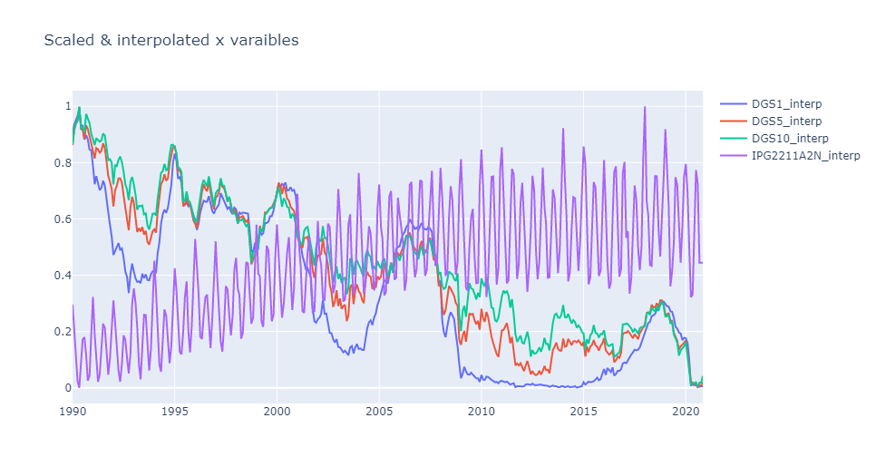
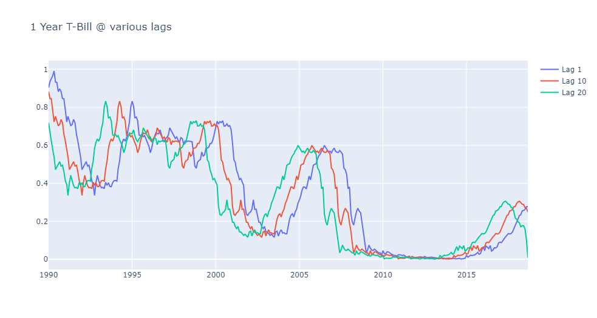

# Overview

This is demonstration using LSTM networks to forecast samples time series data. The model includes four data sets from FRED, electricity and gas demand (our prediction objective), and the 1, 5, and 10 year US T-bills yields. The objective is to forecast electricity demand using electricity consumption in an autoregressive capacity, and using the T-bill yields as additional predictors. The rationale for including these variables is that the shape of the yield curve is thought to correlate with economic health, which in turn should correlate to electricity usage.

## Setup

Clone the repository and install the requirements (`requirements.txt`) into a virtual environment. Note that the `jupytext` plugin is used to convert the Jupyter notebooks to markdown which works much better with `diff`.

## Modeling

### Data Conditioning

The raw data from FRED is first cleaned and up-sampled to daily values using step interpolation (previous value) to fill in gaps. Data outside of the range of values in extrapolated using the last know good value at either endpoint. The data is then put in the range [0,1] using an extended version of the `MinMaxScaler` in `scikit-learn` , `lstmutil.Scaler`. This modified scaler adds support for serialization to and from JSON.

### Validation

Time series data in is general highly correlated in time (auto-correlation), so standard out of the box validation procedures like K-fold validation will not work. For an overview of the challenges see:

- https://medium.com/@samuel.monnier/cross-validation-tools-for-time-series-ffa1a5a09bf9
- On the use of cross-validation for time series predictor evaluation. C Bergmeir, JM Benítez - Information Sciences, 2012 - Elsevier
- A note on the validity of cross-validation for evaluating autoregressive time series prediction. C Bergmeir, RJ Hyndman, B Koo - Computational Statistics & Data Analysis, 2018 - Elsevier

In this project we use a simple rolling horizon method, with a timestep of a single month. For example, at a single point in time, 24 different values of one of the predictors (the 1-year T-Bill) is used for modeling:

For for any given time, we have 24 x 4 = 96 predictors available. From this, we attempt to predict the electricity consumption at M+1, M+2, and M+3 (M=current month).

### Data sets used in this work

| *Filename*       | *Description*                                           |
| ---------------- | ------------------------------------------------------- |
| `DGS1.csv`       | FRED, 1-Year Treasury Constant Maturity Rate (DGS1) Percent, Not Seasonally Adjusted, Updated: Nov 10, 2020                   |
| `DGS5.csv`       | FRED, 5-Year Treasury Constant Maturity Rate (DGS5) Percent, Not Seasonally Adjusted, Updated: Nov 10, 2020                   |
| `DGS10.csv`      | FRED, 10-Year Treasury Constant Maturity Rate (DGS10) Percent, Not Seasonally Adjusted, Updated: Nov 10, 2020                 |
| `IPG2211A2N.csv` | FRED, Industrial Production: Electric and Gas (NAICS = 2211,2) Index 2012=100, Not Seasonally Adjusted, Updated: Oct 16, 2020 |
